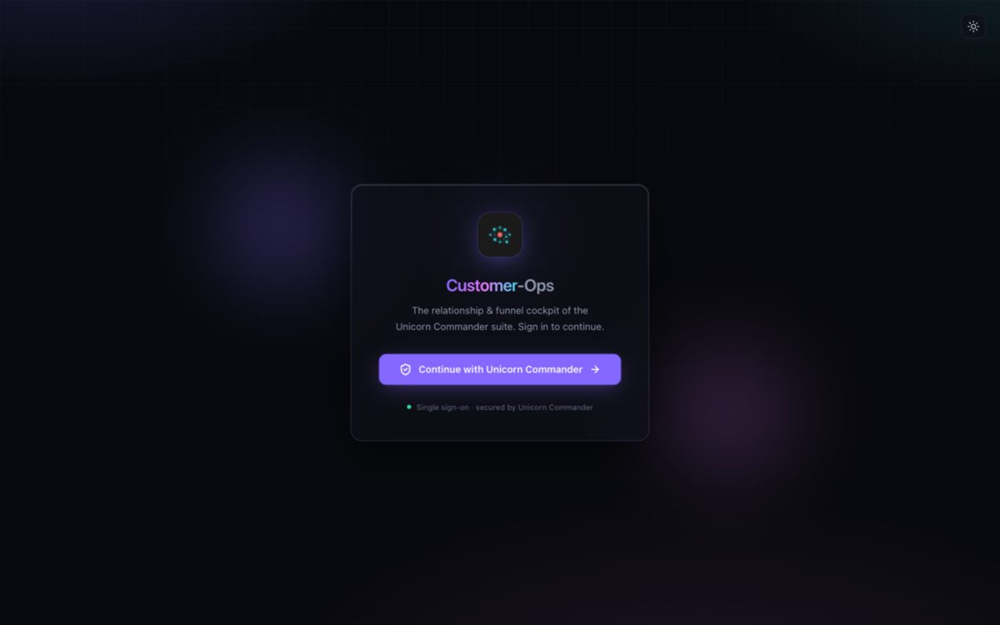

# Contact-Ops

**Status**: Phase 0 (scaffold only, no MCP tools registered yet)
**Date**: 2026-05-21

Contact-Ops is Magic Unicorn's canonical person and organization registry. It is an agent-first, MCP-native platform: the MCP server is the product, and every consumer (human UI, CardDAV server, iOS/macOS sync, agent inboxes, ecosystem apps like Listing-Ops, Crisis-Ops, Project-Ops, Meeting-Ops, Stable, Brigade) composes from a single tool surface. Forked from `centerdeep-data-intel`, which contributes the FastAPI + SQLAlchemy 2.0 async + Postgres + Qdrant + Keycloak `uchub` foundation.

Contact-Ops manages the contacts you actively curate. Data Intel (`verify.centerdeep.online`) stays as the verification / intelligence database. They are peer systems federated via RFC 8693 token-exchange OBO; neither owns the other.


## Screenshots

<p align="center">
  
</p>

<p align="center"><em>Suite relationship graph (federated CRM surface)</em></p>

Live: **[contact-ops.unicorncommander.ai](https://contact-ops.unicorncommander.ai)**

---
## Where things live

| What | Where |
|------|-------|
| AI agent orientation | `CLAUDE.md` |
| Architecture overview | `ARCHITECTURE.md` |
| Ecosystem integration guide | `INTEGRATION_GUIDE.md` |
| Developer workflow | `docs/DEVELOPER_GUIDE.md` |
| End-user guide | `docs/USER_GUIDE.md` |

## Quickstart (local dev)

Track C is still landing the docker-compose Postgres service and migrations runtime. Once those merge, the workflow is:

```bash
# 1. Bring up Postgres + Redis + Qdrant on the unicorn-network
docker compose up -d

# 2. Run migrations
cd backend && alembic upgrade head

# 3. Run tests against the real DB
pytest

# 4. Start the FastAPI + MCP server
uvicorn contact_ops.main:app --reload --port 8501

# 5. Call MCP tools via Claude Code or any MCP client
#    (Phase 0 has NO tools registered, only the JSON-RPC handshake works)
```

Production endpoints (Phase 1+):

| Endpoint | Purpose |
|----------|---------|
| `contacts.magicunicorn.dev` | Human Next.js UI |
| `mcp.contacts.magicunicorn.dev` | MCP HTTP+SSE endpoint (OAuth 2.1 + RFC 8707) |
| `carddav.contacts.magicunicorn.dev` | CardDAV endpoint for iOS / macOS / Thunderbird (Phase 2) |

## Phase plan (from design doc §9)

| Phase | Goal | Duration |
|-------|------|----------|
| 0 (now) | Fork + rename + additive migrations + MCP scaffold | 1-2 weeks |
| 1 | Core MCP tools (people, orgs, employment, identifiers, emails, phones, addresses, tags, search) | 3-4 weeks |
| 2 | Tenancy + ACL + CardDAV + photos | 2-3 weeks |
| 3 | Agents (Dedup, Enrichment, Voice Match, Tag, Lifecycle) + Approval Inbox | 3-4 weeks |
| 4 | FalkorDB graph sync + 3D viewer + relationship tools | 2-3 weeks |
| 5 | Ecosystem migrations (Listing-Ops → Crisis-Ops → Project-Ops → Meeting-Ops → Stable → Brigade) | 4-5 weeks |
| 6 | White-label productization | 3-4 weeks |

## Status

Phase 0 is the scaffold. The Postgres schema (35 tables, 200+ indexes, RLS, HIPAA fence, append-only `action_event`) is in `backend/alembic/`. The MCP server in `backend/contact_ops/mcp/server.py` answers the JSON-RPC handshake but registers no tools yet. Tool surface lands in Phase 1.

The Phase 0 review tracker, blockers, and per-track work threads are in:

## License

TBD. Treat as Magic Unicorn proprietary until Aaron decides on a public license.
